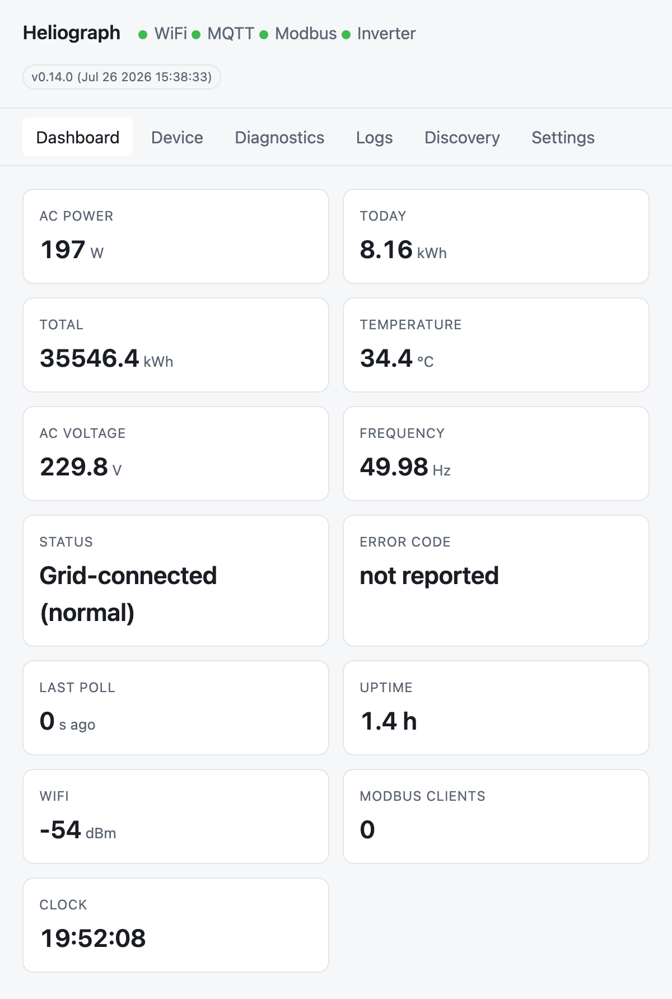
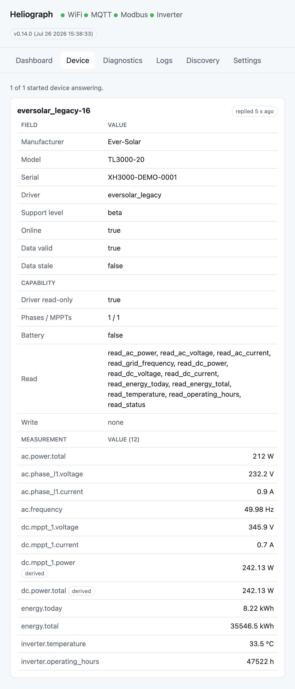
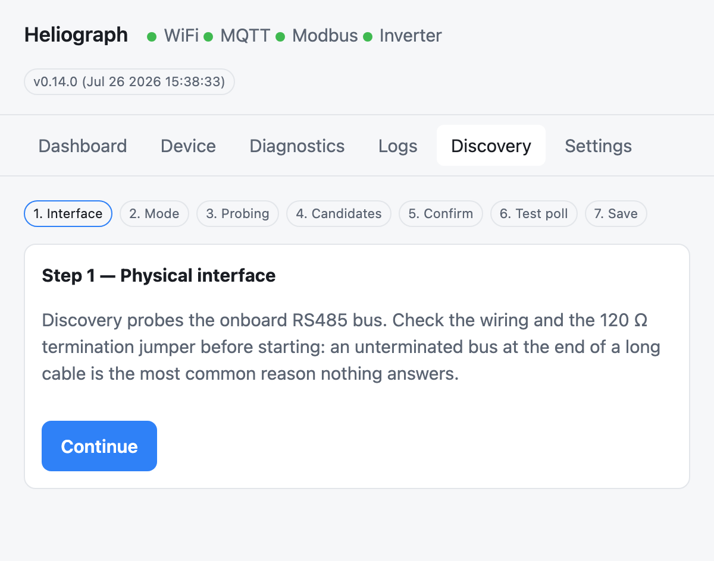

# Heliograph

> A heliograph signalled messages with sunlight. This one translates what your solar
> inverter is saying into languages the rest of your network speaks.

<p align="center">
  <a href="https://github.com/Timdebruijn/heliograph/releases/latest"></a>
  <a href="https://github.com/Timdebruijn/heliograph/actions/workflows/ci.yml"></a>
  <a href="LICENSE"></a>
  
</p>

**Your solar inverter, finally yours.** Whether it is fifteen years old and abandoned by its
manufacturer or fresh out of the box, Heliograph is open-source firmware for a small, cheap box
that sits next to it and speaks its native protocol. It **reads** the inverter and hands the
data to whatever you already use — **Home Assistant, MQTT, Modbus TCP, a REST/JSON API, or
Prometheus** — and on the relay boards it can also **turn the inverter down** when you want it
to produce less. New Modbus inverters go in as a **TOML data file** — no C++, no firmware fork.
It runs entirely on your own network. No account, no cloud, no subscription.

<p align="center">
  <a href="https://timdebruijn.github.io/heliograph/"><strong>⚡ Flash it from your browser — nothing to install →</strong></a>
</p>

<p align="center">
  
  <br>
  <em>The built-in dashboard — a long-unsupported EverSolar read live over RS485, with no cloud and no app in between.</em>
</p>

---

## The problem

Solar inverters are built to last twenty years. The software around them is not.

- **The manufacturer's monitoring died.** The portal was shut down, the app stopped working,
  or the monitoring dongle is no longer supported. The inverter still produces perfectly —
  you just cannot see it any more. Heliograph exists because of an EverSolar that
  outlived its own monitoring portal.
- **Your data goes to their cloud first.** Production figures from equipment in your own
  home travel to a manufacturer's server, come back minutes later, and vanish when your
  internet does. You cannot query yesterday's output without asking someone else's website.
- **It does not talk to anything you own.** No MQTT, no Modbus, no API — so the numbers
  never reach Home Assistant, your dashboards, or your own monitoring.
- **You cannot turn it down when you need to.** With negative electricity prices or a
  feed-in limit, you may want the inverter to produce less. Most consumer inverters offer no
  way to do that locally.

Heliograph addresses the first three for the inverters it supports, and the fourth on the
relay boards (see [Curtailment](#curtailment-turning-the-inverter-down)).

## What it does

### It reads your inverter

Heliograph speaks your inverter's native protocol over RS485, converts everything into one
common set of measurements, and republishes that:

| Integration | How |
|---|---|
| **Home Assistant** | MQTT with auto-discovery — entities appear on their own |
| **MQTT** | Any broker, your own topics |
| **Modbus TCP** | Port 502, for building/industrial tooling |
| **REST / JSON** | `/api/v1/` — see [docs/rest-api.md](docs/rest-api.md) |
| **Prometheus** | `/metrics` — see [docs/prometheus.md](docs/prometheus.md); also readable by Zabbix and Checkmk |
| **Web dashboard** | Built into the device; works with no internet at all |

<p align="center">
  
  <br>
  <em>Everything the inverter reports collapses into one canonical model — which is why the same values reach Home Assistant, MQTT, Modbus, REST and Prometheus without any per-output glue.</em>
</p>

### And it can turn your inverter down

On the relay boards, Heliograph drives the **DRM input** that many inverters carry — the
demand-response terminals an energy company would otherwise use — so you can cut or step down
production during negative electricity prices or under a feed-in limit. You control it from
Home Assistant, MQTT or the API, like any other switch.

This matters most precisely where the reading side is limited: for an inverter that exposes no
way to write a power limit over RS485, a DRM contact is often the **only** control path that
exists. It is the one thing here that acts rather than observes, so it ships switched off,
behind two independent gates, and fails safe by design — details in
[Curtailment](#curtailment-turning-the-inverter-down).

### And you can teach it a new inverter

Most Modbus inverters can be added **without touching C++**. A driver is a TOML file listing
the registers and their scaling, compiled into the firmware at build time — if you can read
the register table in your inverter's manual, you can write one. Every integration above then
works for it for free, because outputs only ever see the canonical measurements, never the
raw protocol. There is even a probe script for reading a device you have in front of you.

Full walkthrough: [docs/adding-a-device.md](docs/adding-a-device.md).

---

## Which inverters work today?

**Start here** — this is the question that decides whether the rest is worth your time. One
inverter family is in daily production use; several more are implemented and waiting for their
first real-world confirmation. And if yours is not on the list yet, you are not stuck: adding a
Modbus inverter is a data file, not a code change (see
[Help support your own inverter](#help-support-your-own-inverter)). The honest, per-family
picture:

| Inverter family | Connection | Status |
|---|---|---|
| EverSolar / Zeversolar legacy (TL series) | RS485 | **Beta** — running in production, in a multi-day soak toward Stable |
| Growatt SPH hybrid (3–6 kW) | Modbus RTU over RS485 | **Experimental** — register map transcribed from documentation, not yet confirmed against real hardware |
| Growatt MIC TL-X (0.6–3.3 kW, single phase) | Modbus RTU over RS485 | **Experimental** — map cross-checked against two independent sources that agree, not yet confirmed against real hardware; see [docs/growatt-mic-tl-x-protocol.md](docs/growatt-mic-tl-x-protocol.md) |
| SolaX X1 series (X1 Mini G1/G2/G3) | RS485 | **Experimental** — the first attempt on real hardware (an X1-Mini-G1) returned no data at all. Read [docs/solax-x1-protocol.md](docs/solax-x1-protocol.md) before you buy or wire anything |
| Any inverter implementing **SunSpec** | Modbus RTU over RS485 | **Experimental** — one generic driver for the published standard, so no per-vendor file is needed. Not yet confirmed against any physical device; see [docs/sunspec.md](docs/sunspec.md) for which vendors are worth trying |

What the labels mean:

- **Beta** — works, in daily use, still collecting evidence before being called Stable.
- **Experimental** — the protocol has been implemented from documentation, but nobody has
  confirmed it against that inverter yet. It may simply not work. You would be the first.

Two more things to check on your own inverter:

1. **Does it have an accessible communication port?** Usually a screw terminal marked
   RS485/COM, or an RJ45 socket. It must be reachable from outside — you should never need
   to open the inverter.
2. **Is that port free?** If a manufacturer's WiFi dongle is plugged into the port you need,
   it may have to come out. On some models the dongle sits on a separate port and both can
   stay; on others it does not.

**Not in the table?** That does not have to be the end of it — see
[Help support your own inverter](#help-support-your-own-inverter). Adding a Modbus inverter
is a data file, not programming.

---

## Before you start: what you are getting into

**Read this properly. Heliograph is a do-it-yourself project.**

- You will be connecting two or three wires to your inverter's **communication port**. That
  is low-voltage data wiring — **not** mains, and **not** the DC side of your panels.
- Everything described here uses **external ports only**. You should never open the
  inverter's enclosure. If a guide ever tells you to, stop.
- Your inverter is still equipment connected to the grid. **If you are not comfortable
  working around it, ask a qualified installer.** There is no shame in that, and it is far
  cheaper than the alternative.
- Always follow **your inverter's own manual** for what its connector pins do. Pinouts differ
  between models and even between generations of the same model. Never assume.
- Interfering with a communication port can, on some models, affect warranty or the
  manufacturer's monitoring. Check before you commit.
- Heliograph is provided under the MIT licence: **no warranty, at your own risk**. It only
  ever *reads* your inverter unless you deliberately enable the relay features described
  below.

---

## Getting started

### 1. Get the hardware

You need one ESP32-S3 board with an RS485 port. Pick based on whether you also want
curtailment:

| Board | What it adds | Status |
|---|---|---|
| [Waveshare ESP32-S3-RS485-CAN](https://www.waveshare.com/wiki/ESP32-S3-RS485-CAN) | battery-backed clock; the reference board | **Production** — pick this if you only need to read the inverter |
| [Waveshare ESP32-S3-Relay-1CH](https://www.waveshare.com/wiki/ESP32-S3-Relay-1CH) | 1 relay (on/off curtailment), clock | **Hardware-verified** — boots and actuates its relay on real hardware 2026-07-26; polarity not yet meter-measured |
| [Waveshare ESP32-S3-Relay-6CH](https://www.waveshare.com/wiki/ESP32-S3-Relay-6CH) | 6 relays (stepped curtailment), status LED, buzzer | **Hardware-verified** — relays, polarity and failsafe measured 2026-07-23 |

Besides the board you need a **USB-C cable**, and wire for the RS485 connection: two data
conductors (**A** and **B**) plus a **ground** reference. A cut Ethernet patch cable is
often the easiest source, and for inverters with an RJ45 communication port it may be all
you need. The RS485-CAN and Relay-6CH can be powered either over USB-C or from a 7–36 V DC
screw terminal, which is handy when there is no USB power near the inverter; check the
product page for whichever board you buy.

For one inverter, A/B/GND is genuinely all there is to it. If you are putting **several
inverters on one bus**, read **[docs/rs485-bus.md](docs/rs485-bus.md)** first: chain topology,
where the 120 Ω termination goes (two places, not one per device), and why each unit needs its
own address before you connect them together.

> **Several inverters on one bus are polled in turn**, up to eight, each with its own address.
> The first is configured under *Settings → Driver*, the rest under *Settings → Extra devices* —
> one row per inverter, each with its own driver and whatever that driver needs to address it.
> The page refuses to save a row with no driver, an unset register map, or an address already
> in use, because all three are mistakes the firmware can only report as a log line at boot.
> Save, then restart. Afterwards the **Device** tab lists every inverter that is actually being
> polled, and says so plainly when one of the configured ones is missing and why.
>
> Over the API it is one field, and sending the array **replaces** it:
>
> ```
> curl -u admin:PASSWORD -X PATCH http://<bridge>/api/v1/config \
>   -H 'Content-Type: application/json' \
>   -d '{"additional_devices":[{"driver_id":"growatt_modbus","options":{"unit_id":"2"}}]}'
> ```
>
> **Extended discovery sweeps addresses 1–8**, so the wizard reports one candidate per inverter
> with the address each answered at — use it to check that the addresses you assigned actually
> took. It configures one device; the rest go in `additional_devices` as above. Quick discovery
> is unchanged: each driver's default address only.
>
> **Every output carries all of them now.** Modbus TCP serves one **unit id per inverter**,
> consecutively from `modbus.unit_id` — unit 1, 2, 3 with the default — and the register map is
> the same at each. Prometheus labels every inverter series with `device="…"`, the same id REST
> and Home Assistant use. Note that the units share one bus and one poll interval, so each is
> read roughly every N intervals with N inverters.

### 2. Flash the firmware

- **In your browser (easiest):** open the
  [web installer](https://timdebruijn.github.io/heliograph/) in Chrome or Edge, plug the
  board into your computer with USB-C, pick your board, click Connect. Nothing to install.
- **With esptool:** download `heliograph-<version>-<board>-factory.bin` from the
  [latest release](https://github.com/Timdebruijn/heliograph/releases/latest):

  ```bash
  esptool.py --chip esp32s3 write_flash 0x0 heliograph-<version>-<board>-factory.bin
  ```

- **From source:** `pio run -e waveshare-rs485-can` (or the environment for your board), then
  flash `.pio/build/waveshare-rs485-can/firmware.factory.bin`.

Already running Heliograph? Update over the air instead — *Settings → Firmware update* with
the release's `heliograph-<version>-<board>.bin`. **Settings survive an over-the-air update;
a factory flash erases them.**

### 3. Connect it to your WiFi

On first boot the board creates its own WiFi network called **`Heliograph-Setup-XXXX`**. Join
it with your phone or laptop; the setup page opens by itself. Choose your network, set an
admin password, and save. The board reboots and tells you the address to visit, something
like `http://heliograph-a1b2c3.local`.

**Write that admin password down.** The same setup network comes back on its own if the board
later loses WiFi for a few minutes — a router reboot is enough — so that you can point it at a
new network without digging the board out. Because that network is open and anyone in range
could otherwise reconfigure your bridge, changing anything through it asks for the admin
password once one is set.

If you lose the password, the way back in is a **factory reset**: hold the board's **BOOT**
button for about 5 seconds while it is running. That erases the stored configuration — WiFi,
password, everything — and returns the board to first-boot setup. Failing that, re-flash a
`-factory.bin` over USB, which wipes the same settings.

Two things worth knowing before you rely on it. On the Relay-6CH the countdown blinks the LED
and the buzzer confirms the wipe; **on the RS485-CAN there is no LED and no buzzer, so the hold
gives no feedback at all** — the board simply reboots into setup when it worked. And the reset
itself is only hardware-verified on the Relay-6CH; on the other two boards the pin comes from
the schematic and nobody has run it. Details and the download-mode caveat:
[docs/hardware.md](docs/hardware.md#recovery--hold-boot-to-factory-reset).

### 4. Wire it to the inverter

With the inverter's manual in front of you, connect:

- board **A** → inverter **A** (sometimes labelled D+)
- board **B** → inverter **B** (sometimes labelled D−)
- board **GND** → inverter **GND**

Connect the ground. It is not optional folklore: without a shared reference the bus can stay
completely silent no matter how the data wires are arranged. And if nothing comes through at
first, **swapping A and B is the single most common fix** — it cannot damage anything.

### 5. Find your inverter

Open the dashboard and run the wizard on the *Discovery* tab. It tries the supported
protocols and proposes a driver. It identifies the **protocol**, not the model — so a driver
that ships several register maps still needs the map chosen, and the wizard's confirm step
asks for it. If nothing answers, turn the log level up to `trace` under *Settings* and watch
the *Logs* tab — it shows exactly what is being sent and whether anything comes back.

<p align="center">
  
  <br>
  <em>Discovery is a guided wizard: it probes the bus, proposes a driver, and lets you confirm with a test poll before anything is saved.</em>
</p>

### 6. Connect your tooling

MQTT and Home Assistant discovery are configured under *Settings*; enable MQTT, point it at
your broker, and the entities appear in Home Assistant by themselves. Modbus TCP listens on
port 502, Prometheus scrapes `/metrics`, and the JSON API lives under `/api/v1/`.

---

## Curtailment: turning the inverter down

The relay boards can drive an inverter's **DRM input** (the demand-response terminals many
inverters carry) to reduce or stop production — useful during negative electricity prices or
under a feed-in limit. This matters most for the inverters Heliograph can only read: if there
is no way to write a power limit over RS485, a DRM contact may be the only control path that
exists.

Three things are worth understanding before you consider it:

**Status: the actuator is proven, the connection to an inverter is not yet.** On the Relay-6CH
the relays themselves have been verified on real hardware (2026-07-23): channel order,
polarity, the power-cut failsafe and the de-energised boot state were all measured rather than
assumed. The Relay-1CH's single relay has since been actuated on hardware too (2026-07-26),
though its polarity and failsafe have not yet been meter-measured the way the 6CH's were. What
has *not* happened yet on either board is driving a real inverter's DRM port — that step is
waiting on a manufacturer's confirmation of how their terminals expect to be driven. Treat this
as a capability that is built and bench-tested, not as one that has been run in the field.

**It ships switched off.** Two independent settings must both be changed before a relay can
move (`relays.enabled` on, and `security.read_only_mode` off). A relay board with factory
settings is inert.

**Failing safe is a wiring decision.** A de-energised relay leaves its NO contact open and its
NC contact closed. Whichever way round your inverter expects its DRM input, one of those two
contacts keeps the rule *"if the bridge dies, the inverter keeps producing"* true — without
changing any firmware setting. On the 6CH this was measured, not assumed: cutting power
releases the contact immediately, and the board boots with every relay de-energised. No relay
state is stored anywhere, deliberately, so a reboot can never restore a curtailment nobody
just asked for.

Full wiring rules and a pre-flight checklist: **[docs/drm.md](docs/drm.md)**. Check your own
inverter's manual for what its DRM terminals expect — this varies by manufacturer and must
never be guessed.

---

## Help support your own inverter

If your inverter is not in the table, you are exactly the person this project needs. There
are three ways to help, and only one of them involves writing code:

1. **Tell us it exists.** Open a
   [device request](https://github.com/Timdebruijn/heliograph/issues/new/choose) with the
   model and whatever documentation you have. Sometimes the protocol is already known.
2. **Add a Modbus inverter yourself — as a data file.** Modbus devices are described by a
   TOML file listing registers and scaling, not by C++. If you can read a register table in a
   manual, you can write one.
   [docs/adding-a-device.md](docs/adding-a-device.md) walks through it, including a script
   for probing a device you have in front of you.
3. **Confirm an Experimental driver.** The Growatt SPH and SolaX X1 drivers are implemented
   but unproven on real hardware. If you own one, running it and reporting what happened —
   including "it returned nothing" — is genuinely valuable. That is how the SolaX findings
   already in the docs came to be.

See [CONTRIBUTING.md](CONTRIBUTING.md) for the practicalities.

---

## How it is built

A strict layering — Transport → Driver → canonical measurement model → output adapters —
keeps brand-specific knowledge confined to `src/drivers/<driver>/`. Outputs only ever see
canonical measurements and capabilities, which is why a new driver gets every integration for
free. The protocol core is platform-independent and host-tested, so most of the firmware can
be verified without any hardware. Unknown values are published as *null or omitted, never
zero* — a missing reading must never look like a real measurement of nothing. Over-the-air
updates are guarded by a watchdog-backed bootloader rollback that has already earned its keep
in this project's own history.

Details: [docs/architecture.md](docs/architecture.md).

## Development

```bash
pio test -e native          # 442 host tests, no hardware needed
./tools/check_layering.sh   # architectural invariants
pio check -e native         # static analysis (cppcheck)
ruff check tools/           # lint for the Python tooling
pio run -e waveshare-rs485-can   # or -relay-1ch / -relay-6ch
```

The `mock` environment runs the full output stack against a simulated inverter — useful for
UI and integration work without an RS485 bus. It adds two virtual relays and compiles the real
drivers out; the **driver itself is in every shipped image**, so on real hardware you can just
pick *Mock Inverter* under Settings → Driver.

It models a three-phase hybrid with two MPPTs and a battery — deliberately unlike any single
real device, so an output adapter that quietly assumed one phase or no battery has something to
fail against. Give each one a `unit_id` under **Extra devices** and you can run a whole
simulated fleet: separate device ids, separate MQTT subtrees and Home Assistant devices,
consecutive Modbus unit ids, and one `device` label per instance in Prometheus. Their solar
curves are staggered, so they report different values at the same moment rather than one number
multiplied by N — which is what makes a shared store or an off-by-one unit id visible instead of
plausible.

What it cannot do is anything at the byte level: it ignores the transport entirely, so protocol
framing, checksums and timing still need real hardware.

All inverter drivers are **read-only**, and that is not in tension with the curtailment above:
no driver ever writes to your inverter over its protocol. Sending a setpoint would need a
hardware-verified register map and a deliberate write path, and neither is enabled today (see
[docs/device-profiles/schema.md](docs/device-profiles/schema.md) for how write support is
staged). Curtailment works the other way round — a potential-free contact on the bridge closing
a circuit the inverter already offers for exactly that purpose, with no protocol write at all.

## License

MIT — see [LICENSE](LICENSE). Protocol knowledge was re-implemented from community
references; credits and third-party licences in
[LICENSE-THIRD-PARTY.md](LICENSE-THIRD-PARTY.md).
